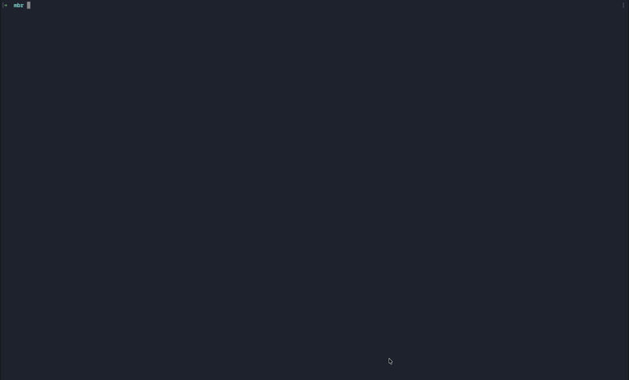

# mbr — Make Bezos Rich

> A terminal UI for browsing, mapping, and auditing your AWS infrastructure.



`mbr` scans your AWS account across every enabled region, builds a live resource graph, detects orphaned (wasted) resources, and surfaces 30-day cost breakdowns — all inside your terminal. No browser, no console, no waiting for the AWS UI to load.

---

## Features

- **Multi-region scan** — scans all 31 AWS commercial regions concurrently; pick any subset from the TUI picker
- **Resource graph** — maps relationships between resources (VPCs → subnets → instances → security groups, etc.)
- **Orphan detection** — flags stopped RDS instances, empty ELBs, idle ASGs, unattached EBS volumes, and more
- **Cost explorer** — shows 30-day blended USD cost per resource and per service
- **IAM dashboard** — lists all roles and policies with usage status (active / stale / unused / never used)
- **Rich detail views** — security group inbound/outbound rules, ASG capacity and AZ breakdown, RDS connectivity and management settings
- **CLI mode** — headless `scan` and `orphans` subcommands pipe JSON or text to stdout

---

## Resource coverage

| Category    | Resource types                                                                 |
|-------------|--------------------------------------------------------------------------------|
| Networking  | VPC, Subnet, Security Group, Internet Gateway                                  |
| Compute     | EC2 Instance, EBS Volume, Lambda Function, Load Balancer (ALB/NLB), Load Balancer (Classic), Auto Scaling Group |
| Databases   | RDS Instance, RDS Cluster, DynamoDB Table, ElastiCache Cluster                 |
| IAM         | Role, Customer-managed Policy                                                  |

---

## Installation

**curl (recommended):**

```sh
curl -sSfL https://raw.githubusercontent.com/angsak/mbr/main/scripts/install.sh | sh
```

Installs to `/usr/local/bin/mbr`. To install somewhere else:

```sh
MBR_INSTALL_DIR=~/.local/bin curl -sSfL https://raw.githubusercontent.com/angsak/mbr/main/scripts/install.sh | sh
```

Supports macOS (arm64, amd64) and Linux (arm64, amd64).

---

**Go install:**

```sh
go install github.com/angsak/mbr/cmd/mbr@latest
```

**Build from source** (requires Go 1.21+):

```sh
git clone https://github.com/angsak/mbr
cd mbr
make build        # → bin/mbr
```

---

## Requirements

- An AWS account with credentials configured (`~/.aws/credentials`, `AWS_PROFILE`, or instance role)
- The IAM principal needs read-only access to the services you want to scan. The AWS-managed `ReadOnlyAccess` policy covers everything.

---

## Usage

```
mbr                          # Launch the interactive TUI (default)
mbr --profile staging        # Use a named AWS profile
mbr --region us-east-1       # Limit scan to one region

mbr scan                     # Headless scan, print resources as text
mbr scan --output json       # Print as JSON
mbr orphans                  # List orphaned resources
mbr orphans --output json    # Orphans as JSON
mbr version                  # Print version info
```

---

## Key bindings

### Region picker

| Key | Action |
|-----|--------|
| `↑` / `↓` or `j` / `k` | Move cursor |
| `space` | Toggle region |
| `a` | Select all / deselect all |
| `/` | Filter regions by name |
| `enter` | Start scan |

### Resource list

| Key | Action |
|-----|--------|
| `↑` / `↓` | Navigate |
| `enter` | Open resource detail |
| `i` | Open IAM dashboard |
| `o` | Toggle orphan-only view |
| `g` | Open resource graph |
| `esc` | Go back |

### Resource detail

| Key | Action |
|-----|--------|
| `↑` / `↓` or `j` / `k` | Scroll |
| `pgup` / `pgdn` | Page up / down |
| `esc` | Back to resource list |

### IAM dashboard

| Key | Action |
|-----|--------|
| `tab` | Switch between Roles and Policies tabs |
| `↑` / `↓` | Navigate |
| `esc` | Back |

---

## Project structure

```
cmd/mbr/          Entry point, Cobra CLI
internal/aws/
  collector/      Resource collectors, one file per service group
  graph/          Resource graph builder and edge rules
  orphan/         Orphan detection rules
  cost/           Cost Explorer integration
tui/
  views/          BubbleTea models (region picker, resource list, detail, IAM, graph)
  app.go          Root app model and screen router
```

---

## Building for other platforms

```sh
make cross   # builds linux/amd64, linux/arm64, darwin/amd64, darwin/arm64, windows/amd64 → dist/
```

---

## License

MIT
